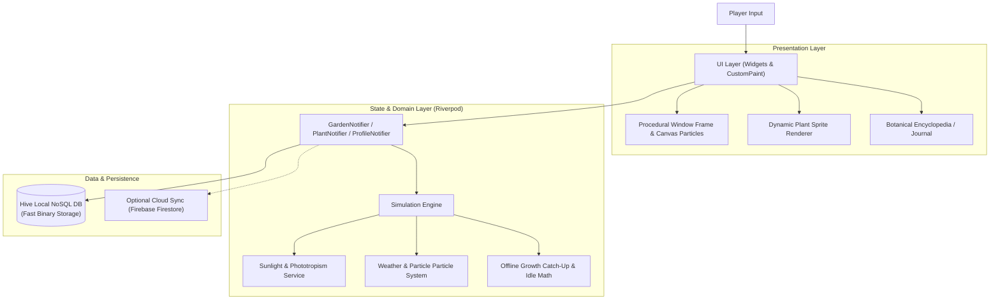

# Window Garden Idle 🌿🪟

[](https://flutter.dev)
[](https://dart.dev)
[](https://riverpod.dev)
[](https://docs.hivedb.dev/)
[](https://firebase.google.com)
[](https://opensource.org/licenses/MIT)

> **Window Garden Idle** is a cozy, offline-first botanical simulation and idle game built with Flutter and Dart. Designed to gently teach real-world botany, phototropism, and species care mechanics, it combines procedural environmental rendering with an asynchronous idle growth engine.

---

## 🌻 The Concept

Transform your digital windowsill into a thriving botanical conservatory. Unlike standard idle games with arbitrary multipliers, **Window Garden Idle** models growth on authentic botanical principles:

- **Photoperiodism & Sunlight Math**: Simulates diurnal sunlight trajectories and window orientation (North, South, East, West) affecting photosynthesis rates.
- **Dynamic Weather & Microclimates**: Real-time atmospheric particle effects (gentle rain, snowfall, overcast gloom) that alter ambient humidity and watering depletion rates.
- **Deep Taxonomy & Field Guide**: Over 10 distinct botanical classes with species-specific care requirements (Bonsai, Medicinal, Culinary, Ornamental, Superfoods, Bog, Aquatic, Ferns, Bulbs, and Tea Herbs).

---

## 🛠️ Software Architecture



---

## 🚀 Key Engineering Features

- **Reactive State Management with Riverpod**: Complete decoupling of UI widgets from game logic. Uses `ChangeNotifierProvider` and state selectors to minimize rebuild cycles.
- **Sub-Millisecond NoSQL Storage via Hive**: Pure-Dart key-value storage engine storing plant instances, unlocked species, garden locations, and journal progress with minimal CPU and memory overhead.
- **Procedural Canvas Rendering (`CustomPainter`)**:
  - Procedural wooden/stone window frames dynamically adapting to aspect ratios.
  - GPU-accelerated particle systems rendering animated raindrops, snowflakes, dust motes, and sunlight rays.
- **Adaptive Audio Engine**: Ambient background soundscapes and gentle interactive sound cues using `audioplayers`.
- **Offline Idle Simulation**: Robust time-manager algorithm calculating water consumption, soil drying, and plant growth progression during background or closed-app sessions.
- **Multiplatform Target Support**: First-class compilation profiles for Android, Web (PWA), iOS, and Linux desktop.

---

## 📂 Repository Structure

```text
├── lib/
│   ├── data/           # Botanical taxonomy, species configs, and plant traits
│   ├── models/         # Strongly-typed data models (Plant, Garden, Buff, Weather)
│   ├── services/       # Sunlight calculation, audio, notifications, weather engine
│   ├── state/          # Riverpod notifiers managing app-wide reactive state
│   ├── ui/             # Flutter screens, dialogs, and custom Canvas visualizers
│   └── main.dart       # Application entry point & Hive initialization
├── assets/
│   ├── audio/          # Ambient soundtracks, water splashes, and chimes
│   └── images/         # Hand-crafted pot textures, backgrounds, and frames
├── scripts/            # Asset generation and automation tools
├── test/               # Unit and simulation tests
└── pubspec.yaml        # Flutter manifest, dependencies, and asset definitions
```

---

## 🚦 Getting Started

### Prerequisites
- [Flutter SDK](https://docs.flutter.dev/get-started/install) (3.0.0 or higher)
- Android SDK (for mobile builds) or Chrome (for web builds)

### Installation & Local Run
```bash
# Clone the repository
git clone https://github.com/Etherdancer/window-garden-idle.git

# Navigate into project directory
cd window-garden-idle

# Fetch pub dependencies
flutter pub get

# Run on Web (Chrome)
flutter run -d chrome

# Or run on connected Android device / emulator
flutter run -d android
```

### Building Releases
```bash
# Compile optimized Android App Bundle (AAB)
flutter build appbundle --release

# Compile optimized Web PWA
flutter build web --release
```

---

## 📄 License

This project is licensed under the [MIT License](LICENSE).
